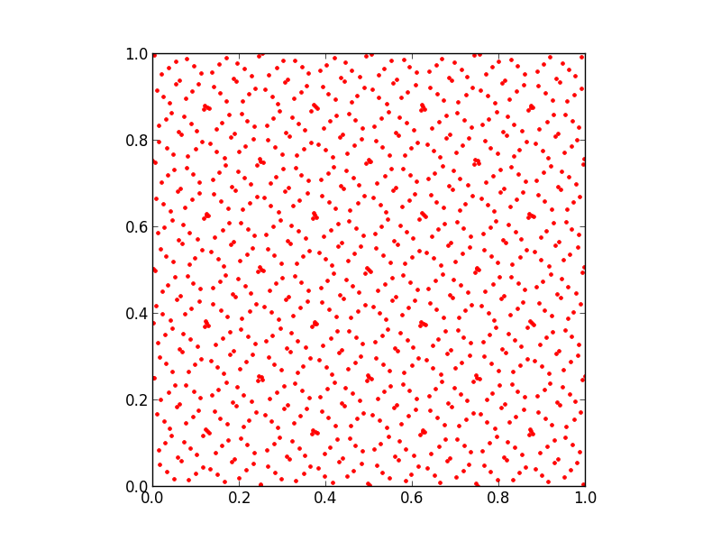

# The Sobol module for Julia
[](https://travis-ci.org/stevengj/Sobol.jl)

This module provides a [Julia-language](http://julialang.org/)
interface to a free [Sobol low-discrepancy-sequence
(LDS)](https://en.wikipedia.org/wiki/Sobol_sequence) implementation.  This
generates "quasi-random" sequences of points in N dimensions which are
equally distributed over an N-dimensional hypercube.

The advantage of an LDS over truly random (or pseudo-random) numbers is
that an LDS (which is *not* random) tends to be more evenly
distributed for finite numbers of points.  This is used in
[quasi-Monte Carlo
methods](https://en.wikipedia.org/wiki/Quasi-Monte_Carlo_method) in
order to accelerate convergence compared to traditional [Monte Carlo
methds](https://en.wikipedia.org/wiki/Monte_Carlo_method) employing
random sequences.

It can be installed using the Julia package manager via `Pkg.add("Sobol")`.

## Algorithm

This is an independent implementation, by Steven G. Johnson, of the
algorithm for generation of Sobol sequences in up to 1111 dimensions
described in:

* P. Bratley and B. L. Fox, Algorithm 659, *ACM Trans. Math. Soft.*
   **14** (1), pp. 88-100 (1988).
* S. Joe and F. Y. Kuo, *ACM Trans. Math. Soft* **29** (1), 49-57 (2003).

Our implementation is in C, and was implemented in 2007 by SGJ as
[part of](https://github.com/stevengj/nlopt/blob/master/util/sobolseq.c) the
[NLopt library](http://ab-initio.mit.edu/nlopt) for nonlinear optimization.
This Julia module is simply a thin wrapper around that C implementation,
and takes advantage of the [NLopt.jl](https://github.com/JuliaOpt/NLopt.jl)
Julia module to ensure that the NLopt library is installed when you
`Pkg.add("Sobol")` in Julia.

It is important emphasize that SGJ's implementation was based on the
mathematical description of the algorithms only, and was done without
reference to the Fortran code from the *Trans. Math. Soft.* (*TOMS*)
papers.  The reason is that *TOMS* code is not free/open-source
software (it falls under [restrictive ACM copyright
terms](http://www.acm.org/publications/policies/softwarecrnotice)).
(SGJ did re-use a table of primitive polynomials and coefficients from
the *TOMS* code, but since this is merely a tabulation of mathematical
facts it is not copyrightable.)  SGJ's implementation in NLopt, along
with these Julia wrappers, is free/open-source software under the [MIT
("expat") license](http://opensource.org/licenses/MIT).

Technically, we implement a 32-bit Sobol sequence.  After
2<sup>32</sup>-1 points, the sequence terminates, and subsequently
our implementation returns pseudo-random numbers generated by the
[Mersenne Twister](https://en.wikipedia.org/wiki/Mersenne_twister) algorithm.
In practical applications, however, this point is rarely reached.

## Usage

To initialize a Sobol sequence `s` in `N` dimensions (`0 < N < 1112`), use
the `SobolSeq` constructor:
```
s = SobolSeq(N)
```
Then
```
x = next(s)
```
returns the next point (a `Vector{Float64}`) in the sequence; each point
lies in the hypercube [0,1]<sup>N</sup>.   You can also compute the next
point in-place with
```
next!(s, x)
```
where `x` should be a `Vector{Float64}` of length `N`.

You can also use a `SobolSeq` as an iterator in Julia:
```
for x in SobolSeq(N)
   ...
end
```
Note, however, that the loop will *never terminate* unless you explicitly
call `break` (or similar) in the loop body at some point of your choosing.

We also provide a different `SobolSeq` constructor to provide
a Sobol sequence rescaled to an arbitrary hypercube:
```
s = SobolSeq(N, lb, ub)
```
where `lb` and `ub` are arrays (or other iterables) of length `N`, giving
the lower and upper bounds of the hypercube, respectively.   For example,
`SobolSeq(2, [-1,0,0],[1,3,2])` generates points in the box [-1,1]×[0,3]×[0,2].

If you know in advance the number `n` of points that you plan to
generate, some authors suggest that better uniformity can be attained
by first skipping the initial portion of the LDS (and in particular,
the first power of two smaller than `n`; see Joe and Kuo, 2003).  This
facility is provided by:
```
skip(s, n)
```

## Example

Here is a simple example, generating 1024 points in two dimensions and
plotting them with the [PyPlot](https://github.com/stevengj/PyPlot.jl)
package.  Note the highly uniform, nonrandom distribution of points in
the [0,1]×[0,1] unit square!
```
using Sobol
using PyPlot
s = SobolSeq(2)
p = hcat([next(s) for i = 1:1024]...)'
subplot(111, aspect="equal")
plot(p[:,1], p[:,2], "r.")
```


## Author

This module was written by [Steven G. Johnson](http://math.mit.edu/~stevenj/).
